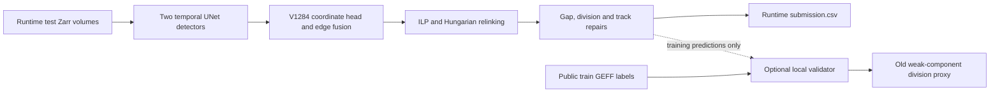

# Biohub x138: source dissection and leakage audit

Source: [biohub x138, scriptVersionId 352391882](https://www.kaggle.com/code/dmitriigluzdov/biohub-x138?scriptVersionId=352391882). The pulled version-1 notebook is `work/x138_original/biohub-x138.ipynb`, SHA256 `044fe7f2524caf218f60e10c8b744d7955bf46825983b488cd982c2acb980941`. `work/x138_original/source.py` is its cell-by-cell extraction for line references. Live submission ref `56520437` is COMPLETE, public `0.953`, 208107715 scored bytes, no API error. The public leaderboard covers about 29% of test data; the final 71% can differ ([Kaggle leaderboard](https://www.kaggle.com/competitions/biohub-cell-tracking-during-development/leaderboard)).

The live top-50 leaderboard read at 2026-09-27 04:18 +07 (`reports/x138_leaderboard_20260927.json`) had rank 1 at 0.978 and ranks 30–34 at 0.964. Thus the requested >0.953 step is smaller than the current upper public frontier; this snapshot does not establish an exact medal cutoff or private standing.

**Validation correction (2026-09-27).** The notebook's `compute_division_confusion` (source lines 4382–4470) counts a GT division as recovered when the parent anchor, both daughter lineages and any predicted fork lie in one weakly connected component. The [current organizer metric](https://github.com/royerlab/kaggle-cell-tracking-competition/blob/075fc5f5a52d11077f9dc2b074644618f26939e2/metrics.md) requires a local fork, two distinct direct-child branches and directed parent-to-daughter evidence. The attached support pack's `biohub_tracking/division_metrics.py` has the same obsolete weak-component rule. Consequently all x139-derived eight-movie division TP/FP/FN figures and combined proxy scores below are **diagnostic approximations, not official-metric scores**. The adjusted-edge figures are descriptive but also need an exact organizer-scorer check before promotion. The actual x138 public `0.953` remains an API result. We preserved the earlier proxy receipts and recorded the correction append-only in `EXPERIMENTS.md`.

There is a second validation representation gap: the train validator scores floating point coordinates immediately after line fitting, while the root submission writer rounds them to integer voxels and clamps below zero. x150 exported both forms of the *same* eight training graphs. Under the pinned current organizer scorer, the x139 base is `0.948346` before writing and `0.945193` after exact lower-clamp/rounding, whereas its older notebook proxy had reported `0.955489`. Neither train number predicts the hidden leaderboard; the scored x138 public `0.953` remains the only hidden-rerun result for this code.

The pinned organizer scorer was run locally on the four visible placeholder movies using only their public training GEFF labels (`work/x138_original/score_visible_official.py`; source/GT manifest receipts in `EXPERIMENTS.md`). x138/x139's CSV scores `0.917982` with division TP/FP/FN `0/0/3`; x147 detector threshold 0.94 scores `0.916596`; x144 DeepCenter threshold 0.20 scores `0.917979`. These are in-sample checks on the four visible placeholders, not hidden-LB estimates. They confirm that neither rejected change improves that exact official-metric subset.

On those four visible movies, x138's old **edge** proxy exactly reproduces the pinned organizer edge TP/FP/FN and adjusted Jaccard for both x138 and x140 (`work/x138_original/compare_proxy_official_visible.py`). The identified proxy error is in division topology, not an observed edge-formula mismatch. Thus x140's eight-training-movie adjusted-edge regression of about `−0.001564` remains adverse evidence even though its four-visible exact edge delta is `+0.000440`; the cohorts differ.

x148's single symmetry relaxation `0.60→0.85` also failed its fixed eight-training-movie diagnostic gate: obsolete approximate proxy `0.955489→0.950089` (−0.005400), adjusted edge −0.000638, old-rule division TP/FP/FN `3/2/9→3/6/9`. Its clean Kaggle run selected the base arm, producing the exact x138 CSV and the same current-organizer visible score `0.917982`; conditional final fork x149 remains local and unsubmitted. The proxy's obsolete division rule limits its absolute meaning, but the adverse paired result and failed preregistered gate are decisive for this arm.

x150's fixed short-track length `6→7` completed cleanly and emitted a valid, distinct runtime CSV. On eight training movies, the pinned organizer score rose only `+0.000807` before serialization and `+0.000804` after exact root-writer rounding/clamping, below its preregistered `+0.0010` gate. On the four visible training placeholders it rose `+0.000919`. Annotated edge counts, division counts and node recall did not improve; the gain comes entirely from the node-count adjustment after pruning short tracks. Both known embryo prefixes improved locally, but these are in-sample movies and the weaker than required effect does not justify a competition POST. The conditional production source x151 remains local; see `work/x150_min7diag/dual_gate_decision.json`.

x152's single-arm linefit-off diagnostic completed cleanly, but the fixed gate rejected it: eight training movies fell **−0.007839** on raw coordinates and **−0.001967** after exact root-writer serialization; the four visible training placeholders fell **−0.002537**. The original smoothing therefore supplies measurable edge-match value in this pipeline, even though it can occasionally move a node adversely. A separately preregistered 2.5 µm guard against extreme fitted shifts, reconstructed from the same-run paired raw graph exports, also fell **−0.001948 raw** and **−0.002572 serialized** across eight movies. Its 44b6 prefix improved about +0.00178 while 6bba worsened −0.00331 raw/−0.00415 serialized. This is a concrete example of a pooled result hiding embryo-dependent transfer risk: selecting by 44b6 alone would have promoted the wrong guard for 6bba. Both variants remain unsubmitted (`work/x152_linefitdiag/paired_official_serialized.json`, `work/x154_linefitguard/paired_official_serialized.json`).

A third, topology-specific linefit check stopped the backward fit before a fork parent. It faithfully replayed baseline coordinates within `2.56e−13` voxel, then changed exactly 419 fork-adjacent daughter coordinates on the eight public TRAIN graphs while preserving all IDs and edges. The pinned scorer reported **zero** raw and serialized score, edge, recall and division change. It failed its preregistered gain gate and was not pushed (`work/x156_topology_linefit/paired_official_serialized.json`). This narrows the observed headroom from linefit changes without proving anything about hidden embryos.

A [separate public measurement write-up](https://www.kaggle.com/code/tomasa2/what-i-measured-and-what-i-got-wrong) reports the same metric pitfall: aggressive short-track pruning can raise the adjusted score while lowering raw edge Jaccard, and four public placeholders are training-volume copies. Its own pipeline differs from x138, so its line-fit and ensemble ablations are context rather than evidence of x138's effect. Our x150 paired receipt independently shows only a node-count adjustment gain, which is why we did not promote it.

The currently pulled public [Anvith Pothula 0.953 notebook](https://www.kaggle.com/code/anvithpothula/biohub-0-953-lb-original) has all 12 source cells identical to x138. The two notebooks are the same inference code under different Kaggle owners; x138's architecture and score should not be treated as independent evidence of a second solution.

Two other top-listed public forks were checked read-only: [Kunal Desale's 0.953 notebook](https://www.kaggle.com/code/kunaldesale2408/biohub-cell-tracking) has AST-identical executable cells to x138, and [Raunak Dey's Harmonic Fusion V3](https://www.kaggle.com/code/raunakdey07/biohub-harmonic-fusion-v3) emits a byte-identical visible `submission.csv` (SHA256 `d52a5d…7909e03`). Their visible outputs do not supply a distinct model ensemble without additional mechanism evidence.

## Cell-by-cell dataflow

| Cell | Role | Material detail |
| --- | --- | --- |
| 0 | Fixed configuration | Sets detector threshold, fusion weights, link/repair/division thresholds, DeepCenter and V1284 paths. Disables runtime train validator; fixes `tight55` from an earlier proxy/public run (source lines 2–110). |
| 1 | Configuration guard | Checks a small subset of environment settings, including detection threshold and bidirectional weight (112–157). Printed baseline/weight descriptions contain stale historical values. |
| 2 | Runtime entry points | Resolves competition `test/`, working paths, output path and numerous graph settings (158–420). |
| 3 | Offline bootstrap | Finds attached support pack, installs offline wheels, materializes predictor and models, SHA-checks primary/secondary/DeepCenter and support code (421–1113). |
| 4 | Predictor construction and test inference | Patches D4 detection TTA, second-seed ensemble, retention guard, harmonic forward/reverse association, ILP timeout, edge-feature TTA, low-confidence detection cache and V1284 coordinate head. Discovers runtime test stems and runs one or two GPU shards (1114–1696). |
| 5 | Graph repair and serialization | Loads inferred GEFF graphs; motion relinks, re-admits detections, fills gaps, adds conservative divisions, removes short tracks, smooths coordinates and writes root `submission.csv` (1697–3919). |
| 6 | Output checks | Checks columns, runtime IDs, retention records, degree/time topology and CSV SHA. Its static source/config attribution is stale (3920–4100). |
| 7 | Optional train sample inference | Would select training movies, preferring examples with divisions, and infer them separately; disabled by cell 0 (4101–4281). |
| 8 | Local proxy scorer | Implements node matching and an approximate edge/division aggregate (4282–4602). Its division rule uses weak-component reachability and is obsolete relative to the current organizer metric. |
| 9 | Base train proxy | Would score cached training predictions and ground truth under the base postprocessor; disabled in x138 (4603–4751). |
| 10 | Parameter sweep/final guard | Would score seven postprocess configurations, choose one by train proxy and rewrite test CSV; with validator off it retains `base` and checks graph topology (4752–4880). |
| 11 | Diagnostic manifest printout | Reports resolved secondary model, bidirectional fusion, DeepCenter and validator state (4881 onward). |

## Effective inference path

The train-label branch is optional and disabled in x138's scored inference run. The x139/x150 diagnostic forks enable it to study parameters; its movies overlap secondary-model training and do not provide embryo-disjoint validation.

1. **Detections.** The notebook loads two SHA-checked temporal UNet checkpoints, averages spatial TTA views and blends secondary detection logits at weight `0.80`. It applies threshold `0.965`; if fusion would retain under 90% of primary candidates in a frame, the frame falls back to the primary detections. The attached DeepCenter model is used later as a repair veto, not as a replacement detector.
2. **Coordinates and links.** The V1284 head samples a central feature vector and six directional differences (224 features), predicts a bounded displacement of at most 2 µm, and adjusts detector coordinates. The temporal edge path mixes the secondary model with weight `0.15`, uses a low-margin consensus policy, and blends forward and reversed edge support with harmonic weight `0.15`. The original forward normalization is along source candidates; the x140 axis correction lost on the paired in-sample proxy, so its apparent formula issue was not an observed improvement.
3. **ILP and postprocessing.** The graph solver uses disappearance weight `2`, division weight `1.2`, appearance weight `0`, and a 1200-second per-dataset timeout. The subsequent Hungarian motion relinker replaces its edges. The output pipeline then re-admits discarded detections near open tracks, fills short gaps from observed/subthreshold peaks, adds geometry/DeepCenter-screened divisions, filters short components, and line-fits coordinates. The `test/*.zarr` stem set is discovered at runtime and yields one root `submission.csv`.
4. **Observed scale, not hidden performance.** On the four visible placeholder movies, x139 (whose final CSV is byte-identical to x138) starts with 121,777 raw nodes and 114,927 raw edges; it outputs 121,219 nodes and 117,041 edges. Postprocessing re-admits 1,337 nodes, adds 483 single-gap, 252 gap2 and 110 low-peak gap nodes, adds 62 safe divisions, removes 2,674 short-component nodes, and line-fits 121,208 nodes. These are mechanical test movies copied from training, so the counts are execution evidence, not leaderboard validation.

Runtime path: each `test/*.zarr` image → dual pretrained UNet detections and edge scores → coordinate refinement and temporal association → ILP graph → notebook graph repairs → root CSV. The original visible run discovered four runtime placeholder IDs, produced 238260 rows with SHA256 `d52a5da2ae5cb0d1b22499f6ca51a00838a6c32ae9a1986ec756ea72e7909e03`; independent graph/schema/ID checks passed in `work/x138_original/visible_audit.json`. The four placeholders are mechanical tests rather than leaderboard scoring data; Kaggle replaces them with a different hidden test set at submission ([organizer discussion](https://www.kaggle.com/competitions/biohub-cell-tracking-during-development/discussion/723921)).

## Leakage and evidence quality

- **Direct hidden-label leakage or frozen answer replay: not found.** Source reads runtime test Zarr and generates predictions. It does not read hidden labels or a parent `submission.csv` from `/kaggle/input`. The notebook's own claim of no ground-truth access is weaker than this source audit, and attached checkpoint provenance still matters.
- **Visible placeholder overlap is established; scored hidden-test overlap is not shown.** The four visible test movies are training-volume copies. Kaggle replaces them with inaccessible test movies for scored submissions, as the [competition data description](https://www.kaggle.com/competitions/biohub-cell-tracking-during-development/data) and [host clarification](https://www.kaggle.com/competitions/biohub-cell-tracking-during-development/discussion/723921) state. Their annotation-based checks can verify mechanics but provide no unbiased estimate of hidden-embryo performance. An [independent public measurement write-up](https://www.kaggle.com/code/tomasa2/what-i-measured-and-what-i-got-wrong) also reports byte-verified visible copies.
- **Do not equate the visible placeholders with the scored public 29%.** The write-up above calls its visible copies a public-leaderboard memorisation readout. For this code competition, the scored public/private sets come from Kaggle's hidden rerun; the four locally visible copies are execution examples. The demonstrated risk to the actual public score is repeated model and parameter selection on a small 29% split, while the private 71% and new embryos may differ. The x138 `0.953` API score itself is real, not a score computed on our four training-copy labels.
- **In-sample validation is established for the secondary seed.** Its downloaded `split_manifest.json` (SHA256 `cbe8ace34ffc157172280538441454b60250f0188faa063d1a9eadfb1ac55c0b`) lists 199 training movies and 40 `test` movies; all 40 `test` IDs are also in its training list. Its `training_config.json` calls this `unet_transformer_alltrain_seed314159_v1` with 199 training and 40 validation movies. All four visible placeholders are in its train list, but only the two `44b6` placeholders are in its `test` list. These internal `test` metrics cannot be called OOF. The x138 runtime validator is off; the diagnostic x139 fork turns it on, but its predictions remain in-sample for at least that model. Exact manifest and config are under `work/x138_original/secondary_provenance/secondary_seed_weights/unet_transformer/split_0/`.
- **DeepCenter has a different, verified split.** The current published `pilkwang/biohub-deepcenter-unet3d-center-prior-v1` `best.pt` has SHA256 `8040999a92f6b7bbd98fa8cf458141e045c0f9ad7c936bdb3b18e1f7edafe2a0`, exactly the value enforced by x138's source line 887. Its `split_manifest.json` SHA256 `c1cc5b597fa9bc647390920affdd5bc4cb27ee1ea84e1cedb59d108a68c2a845` lists all 71 `44b6` movies for training and all 128 `6bba` movies for validation, with no overlap. Thus its 6bba gate evidence has genuine held-out-embryo **weights**, though threshold/epoch choices may still have been selected on that same validation embryo. It is only one component; the x138 secondary detector/linker has trained on both embryos. Exact downloaded manifest and checkpoint are under `work/x138_provenance/deepcenter_provenance/`.
- **Selection bias is established.** Cell 0 fixes `tight55` from an earlier proxy/public run; many named settings were chosen over a long public-LB sequence. The V1284 head comment reports 16/20 movie-level improvements, but the downloaded checkpoint has only weights/mean/scale and no split receipt. Neither establishes embryo-level transfer. Repeated public selection can raise the 29% score while harming the 71% private score.
- **Checkpoint data leakage cannot be fully ruled out from the artifacts inspected.** The secondary all-train manifest proves exposure to training movies, which is legitimate for final training; it does not prove hidden-test contamination. The organizer describes a scored hidden set from different embryos and confirms the visible train-copy examples are replaced at scoring ([data description](https://www.kaggle.com/competitions/biohub-cell-tracking-during-development/data), [host clarification](https://www.kaggle.com/competitions/biohub-cell-tracking-during-development/discussion/723921)). We have not independently observed hidden IDs or fully audited the primary and V1284 checkpoints' training data.
- **Primary checkpoint split is unverified.** The current support pack's `edge_predictor_best.pth` SHA256 `12f6881ee3620a831697ca098ff8f48e687a24225f4e048b538deec3562fe771` equals x138's enforced value. The published `config.json` contains architecture settings but no dataset IDs or split, the pack has no split manifest, and a safe `torch.load(..., weights_only=True)` shows the checkpoint is an `OrderedDict` of tensor parameters without training metadata. This establishes source identity, not training-set independence; do not call the primary predictor embryo-held-out without another training receipt. Downloaded files are under `work/x138_provenance/primary_provenance/`.
- **The V1284 head's holdout claim is unauditable.** Its comment claims 4,136 detection-to-GT pairs from 20 training movies and lower coordinate error on 16 of 20 movies held out by movie. The current `anvithpothula/biohub-v1284-head-s075` dataset lists only `v1284_head.pt` (33,913 bytes; SHA256 `625a0d9340f48193f2ec294fc2d81c5bb3c03087eab78ef0ae998a9c4c7da00c`). Safe loading shows only an MLP state dict plus 224-element mean and scale vectors: no trainer, fold assignments or embryo identifiers. x138 locates the head by glob without a SHA check, so the original run's mounted head identity is also not proven from source alone. This does not prove embryo leakage, but the claimed movie-level comparison cannot establish embryo-disjoint private performance.

## Technical findings and experiments

1. **Association axis mismatch.** The harmonic patch computes `forward_prob = softmax(edge_logits_pair, dim=1)` (source line 1298), but the underlying predictor computes forward candidate-parent probability with `softmax(raw, dim=0)` (`work/x138_original/support/predict_unet_transformer.py`, lines 453–458). Reverse support should normalize candidate children per parent after transpose (`dim=1`). The clean x140 correction lowered the eight-movie in-sample proxy by 0.002993, so this apparently more natural axis did not improve the measured pipeline. It was rejected before competition POST; see `work/x140_axisdiag/paired_result.json`.
2. **Division recall tradeoff.** The Hungarian motion relinker makes one-to-one links and replaces the ILP edge set (source lines 2349–2361 and 3640–3648). Safe-division repair adds some branches later. The clean x142 follow-up cached raw ILP two-child pairs before replacement and allowed only that exact pair past mutual-nearest-neighbor rejection; no such raw pairs existed in the four visible movies, the test CSV was byte-identical to x138, and all eight train-proxy metrics were unchanged. It was rejected before competition POST; see `work/x142_divdiag/paired_result.json`. This null result narrows the mechanism but does not explain all missed divisions.
   In x139's base diagnostic across eight training movies, the safe-division stage logged 708 geometric candidates, 113 after the DeepCenter veto, and 105 added edges. Thus the DeepCenter veto removed most candidates in this configuration; proposal ranking or caps affected only a small remainder. These are mechanics counts, not official TP/FP evidence. Opening filters without a better evidence-based ranking can introduce false forks, as a [public post-patch metric analysis](https://www.kaggle.com/code/megayak/the-0-966-notebooks-used-a-patched-metric-bug) also illustrates on a different setting.
   A local neighborhood audit of the three annotated forks in visible training movie `6bba_05db0fb1` (`work/x138_provenance/official_metric/x139_division_neighborhoods.json`) gives a more precise failure picture. At the first event, the closest predicted second daughter is an orphan but is 9.59 µm from the closest predicted parent, beyond `SAFE_DIV_MAX_UM=9`. At the other two events, the nearest predicted second daughters are already linked to different parents at 1.72 and 0.58 µm, while the candidate dividing parents are 13.53 and 9.31 µm away. The original orphan-only repair cannot reparent either. These are nearest-neighbor correspondences on a public training movie, not certified organizer matches or hidden-set evidence; they guide mechanism design but do not justify a threshold change alone.
3. **Hidden bounds risk.** Line fitting can extrapolate a boundary node beyond the observed image range (3496–3535), while serialization clamps only below zero (3841–3852). Final guards omit actual Zarr upper bounds. A fixed candidate should clamp to each runtime Zarr shape and audit all coordinates before POST. The visible CSV happens to be within typical 64×256×256 dimensions, which does not prove hidden safety.
4. **Provenance reporting.** Cell 6's hard-coded `detector_threshold=0.96875`, `bidirectional_primary_weight=0.30` and source kernel are inconsistent with cell 0's active `0.965`, `0.15` and x138 identity. The V1284 head is located by glob without an SHA check. Correct the report and pin the head in a final fork.
5. **Alternative-link evidence is discarded before motion relinking.** Cell 0 sets `BIOHUB_CACHE_EDGE_THRESHOLD=1.0`, so the cache patch in cell 4 records no finite-probability alternative edges. Cell 5's learned-score lookup is then populated only from ILP-surviving edges; the Hungarian motion relinker assigns alternatives probability zero in its existing `motion + raw distance − 1.0 × probability` cost. This is an information-flow gap, not proof that trusting more links helps: the exact scorer's eight-TRAIN baseline has 195 missed edges, 133 with both endpoints already detected, but 84 of those are both occupied and every simple 2×2 swap raises geometric and inertia cost (`work/x150_min7diag/edge_fn_attribution_serialized_base.json`, `swap_attribution_serialized_base.json`). A preregistered x158 diagnostic will cache the already computed fused candidates above the existing 0.48 edge-admission threshold and feed them into the same 1.0 learned bonus, with a same-run baseline and no hard link lock. It has no score or submission result yet.

## Private-LB promotion rule

The [official metric implementation](https://github.com/royerlab/kaggle-cell-tracking-competition/blob/main/src/tracking_cellmot/metrics.py) combines adjusted edge Jaccard with `0.1 × division Jaccard`; node-count calibration also affects the edge term. The [competition data description](https://www.kaggle.com/competitions/biohub-cell-tracking-during-development/data) says labels are sparse and train/test embryos are disjoint. This makes division false positives, missed crowded detections and embryo transfer more important than a tiny in-sample proxy gain.

Evaluate the final inference policy with both embryo prefixes held out in turn, retraining **every learned component** without the held-out embryo: primary and secondary node/edge predictors, DeepCenter veto, and V1284 coordinate head. Freeze postprocess thresholds before scoring each fold. Report paired per-movie and pooled adjusted-edge, division Jaccard, false-positive counts, node-count calibration, and stability under small threshold shifts. Require gains in both embryo directions or a clear mechanism-diversity reason; use the public score only as a final check. The existing x138 train proxy cannot satisfy this rule. Repeatedly tuning on the same two folds would not create a fresh transfer test. The host permits nonoverlapping [external ZebraHub imaging and tracks](https://www.kaggle.com/competitions/biohub-cell-tracking-during-development/discussion/734330); whole external embryos could be reserved as a locked check if a compatible model is trained. Keep the requested higher-than-0.953 experiment in GOLD_PUBLIC slots 1–2; use PRIVATE_ROBUST slots 3–5 only for a separately qualified candidate.

Independent clean source-only EXP234 models selected detector threshold `0.965` on eight 44b6 validation movies and `0.940` on eleven 6bba validation movies (`reports/exp234_source_44b6_score_v3_20260926.json`, `reports/exp234_source_6bba_score_v3_20260926.json`). That is evidence of embryo-domain sensitivity in a different model bundle, not a validated threshold transfer to x138. It argues for recording per-embryo paired results and a fixed rule that can operate on a new hidden embryo without its labels. A public-LB gain alone should not displace a robust portfolio entry; the official private set has the larger 71% share.

The x139 eight-movie diagnostic also shows predicted/estimated node-count ratios from `0.695` to `1.312`. On the most overcounted movie, `6bba_07e24132`, raw edge Jaccard `0.8564` becomes adjusted edge `0.8297`, a `0.0267` drop; on undercounted `44b6_2a2eff9f`, it rises from `0.8340` to `0.8595`. These are in-sample observations, but they dwarf the +0.000014 postprocess sweep gain. A private-oriented count policy should infer calibration from runtime images and be frozen using embryo-disjoint source validation; hidden ground-truth counts cannot be read or replayed at inference.

Split by source embryo prefix, the same proxy is `0.92096` on four `44b6` movies (division TP/FP/FN `1/1/3`) and `0.96808` on four `6bba` movies (`2/1/6`). These aggregates are not independent holdouts, but their 0.047 gap illustrates why a pooled eight-movie gain can conceal a large domain loss. Require paired improvement or tightly bounded loss in each prefix before using a public candidate as evidence for private selection.

## 2026-09-27 x158 alternative-link diagnostic result

The preregistered x158 clean Internet-off Kaggle run verified that the cache path is real: 1327 non-ILP edge alternatives and 186 supported Hungarian relinks across eight public TRAIN movies. The root runtime CSV passed dynamic-ID, graph/schema, official visible Zarr-bound and no graph-repair/deadline-failure audits. Bound shapes came from a separate read-only Kaggle test-metadata download after execution because the kernel's static guard omitted them. `work/x158_cachelinkdiag/technical_audit.json` and `paired_official_{raw,serialized}.json` bind the evidence.

On the pinned current organizer metric, eight-TRAIN raw score fell 0.9483461443→0.9410398821 and writer-serialized score fell 0.9451931871→0.9378873448. A correct `6bba_09961292` division lost one daughter edge. Four visible training-copy examples rose +0.0017212, mainly on one movie, demonstrating why that subset cannot decide hidden promotion. The fixed gate failed and x158 was not submitted; the conditional production source x159 remains local. This supersedes the earlier prospective wording in this report's alternative-link finding. x138's actual 0.953 public submission is still the only verified scored result for this goal.

## 2026-09-27 x160 V1284 head-off diagnostic result

The fixed head-zero ablation clean-ran as private Internet-off Kaggle x160 v1 and passed exact-source, dynamic-runtime-ID, graph/schema, log, fallback, deadline and actual visible Zarr-bound audits (`work/x160_headoffdiag/technical_audit.json`). It changed the root graph, so the test was not a no-op. Under the byte-pinned current organizer scorer, the eight TRAIN movies fell `0.9483461443→0.9441976777` raw and `0.9451931871→0.9419953538` after the exact root writer. The official division TP/FP/FN remained `2/2/10`; the loss is in adjusted edge Jaccard. Raw embryo-prefix score deltas were 44b6 `+0.029807` and 6bba `−0.020323`; serialized deltas were `+0.026121` and `−0.017689`. Four visible training-copy placeholders fell `0.9179817791→0.9055826973` and gained two false division calls. The fixed preregistered gate failed (`work/x160_headoffdiag/paired_official_gate.json`), so conditional x161 stays local and unsubmitted. This demonstrates a strong embryo-dependent effect of the learned coordinate head, but the in-sample films do not establish its causal transfer effect on private embryos. No score above x138's actual public `0.953` has been obtained for this goal.

## 2026-09-27 exact error taxonomy and localization

The current organizer scorer on x138's exact integer writer output for eight public TRAIN movies gives `0.945193`, with edge TP/FP/FN `5556/236/195` and division TP/FP/FN `2/2/10` ([receipt](../work/x138_error_taxonomy/report.md)). Of the 195 missing annotated edges, 133 have both endpoint cells detected but the link is absent; 62 have at least one unmatched endpoint. In the former group, only **one** link joins two currently free endpoints; most failures involve an occupied link and cannot be repaired by merely connecting track ends. Among ten missed divisions, seven have both daughters detected, but the five already linked daughters have a current link of 0.8–2.2 µm versus a 7.3–11.3 µm proposed reparenting link. The fixed geometry screen rejects all five ([per-event audit](../work/x138_error_taxonomy/occupied_division_report.md)). These are GT-selected in-sample diagnostics and do not prove a deployable reassignment rule.

A matched-centroid audit on the same eight TRAIN movies found mean predicted-minus-GT (z,y,x) residuals of `(0.008,-0.219,-0.034)` voxels for 44b6 and `(-0.265,-0.700,-0.919)` for 6bba, with appreciable per-movie variation ([receipt](../work/x138_quant_diag/offsets.json)). It rejects a fixed +1-voxel lateral output shift as a private-robust hypothesis. The raw-float `0.948346` versus integer-CSV `0.945193` local gap remains in-sample; the organizer's [CSV exporter](https://github.com/royerlab/kaggle-cell-tracking-competition/blob/075fc5f5a52d11077f9dc2b074644618f26939e2/scripts/geffs_to_csv.py) explicitly rounds to integer, while its [importer](https://github.com/royerlab/kaggle-cell-tracking-competition/blob/075fc5f5a52d11077f9dc2b074644618f26939e2/scripts/csv_to_geffs.py) accepts Float64. The hidden Kaggle schema for fractional submissions is not established, and no scored fractional-output witness was found in a bounded public-source check. No floating-coordinate candidate was submitted.

## 2026-09-27 fork and private-validation state

The [x162 private Kaggle fork](https://www.kaggle.com/code/dmitriigluzdov/biohub-x162-baseline-safe) was made from the exact x138 source. Local source [notebook](../work/x162_baseline_safe/biohub-x162-baseline-safe.ipynb), [manifest](../work/x162_baseline_safe/manifest.json), and [diff](../work/x162_baseline_safe/source_diff.patch) show unchanged active detector/association/repair settings, with train validator and parameter sweep removed, V1284 checkpoint pinned, and actual runtime Zarr bounds checked at CSV output. Kaggle version 1 completed privately with Internet disabled; the remote code in all 12 cells matches the local source SHA256 `d761174044943f68f0bf0501c8691ab496b28611779a5a232d13ba27e01c0c51` ([identity](../work/x162_baseline_safe/source_identity_v1.json)). The [independent audit](../work/x162_baseline_safe/independent_v1_audit_final.json) passed with zero errors, and 23 focused tests passed. Its visible root CSV has 238,260 rows, four runtime test IDs, valid integer coordinates and graph, zero repair/deadline fallback, and SHA256 `d52a5da2ae5cb0d1b22499f6ca51a00838a6c32ae9a1986ec756ea72e7909e03`. Those bytes are identical to x138's visible output, so this safety fork has no demonstrated score gain and was not submitted to the competition.

A fully source-only secondary-model LOEO pilot is technically executable: its one-epoch/16-update fold-0 run trained on 44b6, excluded all 6bba, and passed all 19 integrity checks ([reconciliation](../work/x138_loeo_runtime_v3/pilot_final_reconciliation.json)). Its inner validation recall is only 0.330 and it has not scored an outer movie. A deterministic one-movie external-fold scoring path is [prepared](X138_LOEO_FOLD0_PROOF_PREP_20260927.md), not run. Full reciprocal secondary training is estimated at 16–23 A100 hours plus inference. Even if completed, it would not validate the assembled x138 pipeline: primary and V1284 embryo splits are unverified, while DeepCenter used 6bba validation. The practical private-LB promotion requirement remains a fixed inference policy and paired official graph scores from both held-out embryo directions with **every** active learned component excluded from the scored embryo. No current candidate meets that requirement or has a public score above the original `0.953`.

## 2026-09-27 fractional-output format correction and fixed x163 test

Correction to the preceding paragraph's "no scored fractional-output witness" statement: [Xiaolei Lian's public baseline](https://www.kaggle.com/code/xiaoleilian/biohub-cell-tracking-classical-baseline) is version 10 with a reported public score 0.763, and its published root CSV has 70,903 finite node rows with fractional xyz in every row. Pulled source/output SHA256 values and exact counts are in [the witness receipt](../work/float_witness/fractional_witness_receipt.json). The new evidence supports CSV format acceptance; it does not establish a gain from changing x138 coordinates.

The [preregistered x163 test](X138_X163_SUBVOXEL_PREREG_20260927.md) changes only x162's final node xyz writer from integer-rounded to raw, finite, runtime-bounded subvoxel coordinates and updates its output guards. On the same eight TRAIN movies, pinned current-organizer raw versus integer score is 0.9483461443 versus 0.9451931871 (+0.003153); both embryo prefixes pass the predetermined diagnostic gate. The clean Internet-off x163 run and four-visible paired metric are pending. This local signal uses training movies and cannot validate private transfer. No x163 competition POST or public gain is claimed.

The eight-movie effect is heterogeneous: adjusted-edge changes are +0.021356 and +0.008477 on two movies, −0.003553 and −0.011801 on two, and exactly zero on four. Clipping 594 raw out-of-nominal-bounds axis values before the same pinned scorer leaves every per-movie metric and the pooled 0.948346 score unchanged ([supplemental receipt](../work/x163_independent/x150_raw_float_clipped_train_official.json)). A positive aggregate therefore supplies a testable low-cost public hypothesis, while the mixed movie signs prevent a private-robust inference from this data. The clean x163 version remains queued at the last API read; no competition submission has been made.

## 2026-09-28 x163 clean execution and public test pending

The preceding queued/no-submission sentence is now historical. Kaggle completed the exact private, Internet-off [x163 v1](https://www.kaggle.com/code/dmitriigluzdov/biohub-x163-subvoxel), and the [independent audit](../work/x163_independent/technical_audit_v1.json) passed without errors. Its 238,260-row root CSV has four runtime test IDs, 121,219 fractional node rows and the exact same graph, IDs and non-coordinate columns as x162. All node xyz are finite and within actual runtime Zarr bounds; no repair or deadline fallback occurred. The CSV SHA256 is `02633707b988f79b9731953d1b12b1bd1cf5a12cdce6e8fff9a0217d123f1679`.

The [fixed visible quality gate](../work/x163_independent/visible_quality_gate_v1.json) passed under the same pinned organizer metric: x163 `0.9213919478992463` versus x162 `0.9179817790773696`, delta `+0.0034101688218767245`; 44b6 is unchanged and 6bba gains `+0.0035701520483130134`. These four films are training-copy placeholders. The gain proves that decimal serialization can change official matching on this fixed set, but the effect's concentration and earlier per-movie reversals leave private transfer uncertain. This change does not repair linkage/division error modes or provide new embryo-disjoint training evidence.

After a complete [pre-POST receipt](X138_X163_PREPOST_20260928.md), 13 x163 tests, three independent-auditor tests and 14 guarded-helper tests, one allowed `GOLD_PUBLIC` 2026-09-28 slot-1 POST through `scripts/submit_code_file_once.py` returned ref `56628634`. Its [initial full API receipt](../work/x163_independent/submission_api_pending_56628634.json) is `PENDING`, error empty, score empty, bytes zero, with quota one used today. A pending submission is not a measured public gain. For private ranking, the next credible validation still requires identical full-pipeline weights excluded from scored embryos, paired official graph scores in both embryo directions, and stable per-embryo outcomes; no current x163 evidence meets that bar.

Within those four visible movies, both 44b6 graphs have identical official metric rows after the coordinate change. Both 6bba graphs improve adjusted edge Jaccard (+0.006988805 and +0.001467472); together they gain three true matched edges and remove five false matched edges while the predicted graph is identical. This locates the visible gain in scorer correspondence, not new cell detections or links. It is also a warning against extrapolating a pooled +0.003410 directly to a private embryo mix with unknown localization errors.
